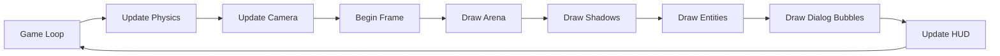

# 🥊 GEO SUMO — Geometric Brawler

<div align="center">

**Um jogo de luta 3D minimalista inspirado em Super Smash Bros, construído do zero com WebGL puro**

[](https://www.khronos.org/webgl/)
[](https://www.khronos.org/opengl/wiki/OpenGL_Shading_Language)
[](https://vitejs.dev/)
[](https://glmatrix.net/)

*Empurre seus oponentes para fora da arena circular usando física realista e combos devastadores*

</div>

---

## 📖 Sobre o Projeto

**GEO SUMO** é um jogo de combate arena-fighter 3D onde geometrias coloridas lutam em uma plataforma circular. Inspirado pela mecânica de knockback de Super Smash Bros, o jogo combina física realista com visual minimalista procedural.

### 🎯 Conceito Principal

Diferente de jogos de luta tradicionais com barra de vida, no GEO SUMO o **dano acumulado aumenta o knockback**. Quanto mais dano você tem (exibido como %), mais longe você é empurrado pelos ataques. O objetivo é jogar seus oponentes para fora da arena circular!

### ✨ Destaques Técnicos

- **100% WebGL Puro**: Sem engines, sem bibliotecas de renderização — WebGL e GLSL do zero
- **Zero Texturas**: Tudo é procedural — cores, gradientes, efeitos de glow
- **Física Custom**: Sistema de física completo com knockback horizontal, hitstun e colisões
- **Mobile-First**: Controles touch otimizados com joystick virtual e zonas de toque
- **Expressões Dinâmicas**: 5 estados faciais diferentes (normal, ataque, dor, stunned, charging)
- **Sistema de Diálogos**: 70+ frases contextuais com efeito typing e áudio procedural
- **Multiplayer Local**: Suporta até 4 oponentes simultâneos controlados por IA

---

## 🎮 Features

### ⚔️ Sistema de Combate

- **Mecânica de Dano Percentual**: Dano acumulado de 0% a 300%+, afetando o knockback exponencialmente
- **Knockback Horizontal**: Força aplicada principalmente na horizontal, facilitando ring-outs
- **Hitstun System**: Stun proporcional ao dano causado, impedindo combos infinitos
- **Charge/Dash**: Segure Shift/Espaço para carregar uma investida poderosa (tachi-ai)
- **Braços Independentes**: Controle os dois braços separadamente (LMB/RMB) para combos
- **Sistema de Vidas (Stock)**: 1-5 vidas por lutador, respawn no centro da arena

### 🎨 Customização Completa

**Formas do Corpo** (8 opções):
- Cubo, Coluna, Disco, Cone, Pizza, Estrela, Prisma, Cápsula

**Paletas de Cores** (12 opções):
- Azul Neon, Ciano, Verde Neon, Amarelo, Laranja, Rosa, Roxo, Vermelho, Branco, Cinza, Água, Dourado

**Tipos de Olhos** (9 opções):
- Redondos, Pontos, Pixel, Laser, Angry, Espiral, Cruz, Linha, Coração

**Tipos de Boca** (10 opções):
- Simples, Larga, Reta, Triângulo, Ziguezague, Onda, Bloco, Vazio, Cruz, Coração

### 🤖 IA e Dificuldade

**3 Níveis de Dificuldade**:
- **Fácil** 🟢: Reação lenta, knockback 1.5x, hitstun reduzido, alta fricção
- **Médio** 🟡: Balanceado, valores padrão
- **Difícil** 🔴: Reação rápida, knockback 0.7x, hitstun elevado, baixa fricção

**IA Comportamental**:
- Cálculo de distância e ângulo para o jogador
- Sistema de decisão (atacar, dash, recuar)
- Movimentação orbital tática
- Adaptação baseada em dano acumulado

### 💬 Sistema de Diálogos

**70+ Frases Contextuais** em 7 categorias:
- **Attack**: "TOME ISSO!", "VAI!", "SENTE O PODER!"
- **Hurt**: "AH!", "UIH!", "NÃO FOI NADA..."
- **Losing**: "TÁ DIFÍCIL...", "PRECISO VIRAR!"
- **Winning**: "TÔ DEMAIS!", "FÁCIL ASSIM?"
- **Intro**: "CHEGUEI!", "BORA LUTAR!"
- **Victory**: "EASY!", "SOU O REI!"
- **Taunt**: "É ISSO AÍ?", "BORA, VEM!"

**Features do Sistema**:
- Efeito typing letra-por-letra (0.5 chars/frame)
- Som procedural de "fala" (blip) com pitch variável por categoria
- Fade in/out suave com duração configurável
- Balões de fala fixados acima da cabeça do lutador
- Projeção 3D→2D correta usando matrizes de view/projection

### 📊 Kill Tracking & Ranking

**Placar Dinâmico em Tempo Real**:
- 🥇🥈🥉 **Ranking**: Ordenação automática por kills
- ⚔️ **Kill Feed**: Últimas 5 eliminações com animação slideIn
- **Contador Individual**: Estatísticas por lutador
- **UI Responsiva**: Adapta para mobile automaticamente

### 🎭 Expressões Faciais

**5 Estados Visuais Dinâmicos**:
- **Normal**: Rosto customizado do jogador
- **Attack** 😠: Olhos furiosos + boca aberta (grito de guerra)
- **Hurt** 😵: Olhos X + boca torcida (dor)
- **Stunned** 😵‍💫: Olhos em espiral + boca ondulada + partículas
- **Charging** 😤: Olhos concentrados + aura pulsante

### 🌟 Efeitos Visuais

- **Screen Shake**: Vibração da câmera em impactos fortes
- **Slow Motion**: Desaceleração temporal em momentos épicos
- **Charge Aura**: Glow pulsante durante carregamento
- **Edge Warning**: Flash vermelho na borda da tela quando próximo da queda
- **Hit Flash**: Flash branco em entidades ao receber dano
- **Particle Effects**: Estrelinhas rotativas quando stunned
- **Color Bleeding**: Corpo muda de cor conforme dano acumulado

### 📱 Controles

#### Desktop
```
WASD          — Movimentação
Mouse         — Mirar braços
LMB           — Soco braço esquerdo
RMB           — Soco braço direito
Shift/Espaço  — Charge (segurar) e Dash (soltar)
```

#### Mobile/Touch
```
Joystick Virtual   — Movimentação (inferior esquerdo)
Toque Esquerdo     — Soco instantâneo esquerdo
Toque Direito      — Soco instantâneo direito
Toque Duplo        — Dash
```

### ⚙️ Opções de Jogo

- **Número de Adversários**: 1-4 inimigos simultâneos
- **Número de Vidas (Stock)**: 1-5 vidas por lutador
- **Dificuldade**: Fácil, Médio, Difícil
- **Randomização**: Botão para personalização aleatória completa

---

## 🏗️ Arquitetura Técnica

### 🔧 Stack Tecnológico

```yaml
Linguagem:      JavaScript (ES6 Modules)
Renderização:   WebGL 1.0 (Raw API)
Shaders:        GLSL (2 vertex shaders + 2 fragment shaders)
Matemática:     gl-matrix 3.4.3 (mat4, vec3, vec4)
Build Tool:     Vite 7.3.1
Audio:          Web Audio API (procedural synthesis)
```

### 📦 Estrutura do Projeto

```
geosumo/
├── src/
│   ├── main.js                    # Game loop, orchestração principal
│   ├── style.css                  # Estilos globais + HUD
│   │
│   ├── engine/                    # Core engine (motor gráfico)
│   │   ├── Renderer.js            # WebGL setup, shader compilation, draw calls
│   │   ├── Camera.js              # Câmera isométrica fixa com pan suave
│   │   ├── Input.js               # Sistema de input (teclado + mouse + touch)
│   │   ├── Haptic.js              # Feedback tátil para mobile
│   │   └── MathUtils.js           # Utilidades matemáticas (lerp, clamp)
│   │
│   ├── game/                      # Lógica de jogo
│   │   ├── Entity.js              # Entidades (player/enemy), expressões
│   │   ├── Physics.js             # Física, colisões, knockback, hitstun
│   │   ├── Player.js              # Controlador do player
│   │   ├── Enemy.js               # IA dos inimigos
│   │   ├── Arena.js               # Arena circular, ring-out detection
│   │   ├── EntityRenderer.js      # Renderização de lutadores, faces, braços
│   │   └── DialogSystem.js        # Sistema de diálogos com typing + audio
│   │
│   ├── audio/
│   │   └── SFX.js                 # Efeitos sonoros procedurais
│   │
│   ├── data/
│   │   └── Customization.js       # Dados de customização (formas, cores, etc)
│   │
│   └── shaders/                   # GLSL shaders
│       ├── floor.vert             # Vertex shader do chão
│       ├── floor.frag             # Fragment shader do chão (gradiente radial)
│       ├── object.vert            # Vertex shader dos objetos 3D
│       └── object.frag            # Fragment shader dos objetos (glow, fresnel)
│
├── index.html                     # HTML base
├── package.json                   # Dependências e scripts
├── vite.config.js                 # Configuração do Vite
└── README.md                      # Este arquivo
```

### 🎨 Pipeline de Renderização



### 🧮 Sistema de Física

**Knockback Calculation**:
```javascript
baseKnockback = punchPower * (1 + defender.damage / 100)
horizontalRatio = 0.82  // 82% horizontal, 18% vertical
finalForce = baseKnockback * difficultyMultiplier * directionVector
```

**Hitstun Duration**:
```javascript
hitstun = min(30, baseDuration * (1 + damage / 200)) * difficultyMultiplier
```

**Charge System**:
```javascript
chargeAmount += deltaTime * 1.2  // 1.2s para carga completa
dashPower = 8 + (chargeAmount * 12)  // 8-20 força
```

### 🎭 Sistema de Expressões

Cada expressão sobrescreve temporariamente a face customizada:

| Estado | Olhos | Boca | Extras | Duração |
|--------|-------|------|--------|---------|
| **Normal** | Customizado | Customizado | — | Padrão |
| **Attack** | Angulosos | Aberta (grito) | — | 20 frames |
| **Hurt** | X vermelho | Torcida | — | 25 frames |
| **Stunned** | Espiral | Ondulada | Estrelas | 30-40 frames |
| **Charging** | Concentrado | Cerrada | Aura | Durante charge |

### 🗣️ Arquitetura de Diálogos

**DialogBubble Class**:
- `phrase`: Texto completo
- `category`: Categoria semântica
- `duration`: Tempo de exibição
- `currentText`: Estado do typing
- `alpha`: Fade in/out

**Trigger System**:
- Por evento (ataque, dano, vitória)
- Por contexto (winning/losing baseado em vidas)
- Esporádico (taunts aleatórios durante luta)

### 🎵 Sistema de Áudio UX — Musical Procedural Engine

**GEO SUMO** possui um sistema de áudio **100% procedural e musical**, onde cada som é sintetizado em tempo real e harmonizado com a escala pentatônica menor de D (Ré menor). O resultado é uma experiência sonora coesa, satisfatória e cinematográfica que reage dinamicamente à intensidade do combate.

#### 🎼 Fundação Musical

**Escala Pentatônica Menor em D**:
```javascript
D (Ré) - F (Fá) - G (Sol) - A (Lá) - C (Dó)
```

**5 Oitavas de Alcance**:
- **Graves** (D3-C4): Sub-bass, kicks, tensão
- **Médios** (D4-C5): Melodias principais, impactos
- **Agudos** (D5-C6): Harmonias, efeitos especiais
- **Super-Agudos** (D6-C7): Brilho, shimmer, perfect hits

**Conversão MIDI → Hz**:
```javascript
frequency = 440 * 2^((midiNote - 69) / 12)
// A4 (MIDI 69) = 440 Hz referência
```

#### 🎹 Primitivas de Síntese

**_tone()** — Synth Completo:
- **Osciladores**: Sine, Triangle, Square, Sawtooth
- **Envelope ADSR**: Attack, Decay, Sustain, Release
- **Modulação**: Vibrato LFO (taxa + intensidade)
- **Espacialização**: Pan estéreo (-1 a +1)
- **Filtros**: Lowpass/Bandpass com Q configurável
- **Detune**: Chorus natural por desafinação sutil

**_chord()** — Acordes Harmônicos:
- Toca múltiplas notas simultaneamente
- Power chords (tônica + quinta)
- Tríades maiores/menores
- Voicings customizáveis

**_melody()** — Sequências Melódicas:
- Padrões rítmicos programáveis
- Espaçamento temporal entre notas
- Transposição dinâmica

**_softNoise()** — Ruído Filtrado:
- Buffer de áudio com white noise
- Filtrado por biquad filter
- Envelope exponencial
- Usado para snares, hi-hats, impactos

#### 🎮 Movimento Musical — WASD Sistema

Cada direção de movimento toca uma nota específica da escala:

| Tecla | Nota | Função Musical |
|-------|------|----------------|
| **W** | D4 (Ré) | Tônica — nota raiz |
| **S** | A3 (Lá) | Quinta abaixo — tensão descendente |
| **A** | F4 (Fá) | Terça menor — melancolia lateral |
| **D** | G4 (Sol) | Quarta — resolução lateral |
| **WA/WD** | Diagonal | Notas intermediárias |
| **SA/SD** | Diagonal | Variações graves |

**Features do Sistema**:
- ✅ Volume dinâmico baseado em velocidade (0.03-0.07)
- ✅ Cooldown inteligente (120ms geral, 200ms mesma direção)
- ✅ Synth curto (50-80ms) para não poluir
- ✅ Pan estéreo sutil para percepção espacial

#### 🥁 Dynamic Music Layers — Adaptive Soundtrack

O jogo possui uma **trilha sonora adaptativa** que nunca para, com camadas que entram/saem baseadas na intensidade do combate:

**6 Camadas Instrumentais**:

| Camada | Tipo | Função | Intensidade |
|--------|------|--------|-------------|
| **Bass** 🎸 | Triangle wave + lowpass | Linha de baixo (D→A→D→G) | Sempre presente |
| **Kick** 🥁 | Sine pitch-bend | Bombo (beats 1 e 3) | Sempre presente |
| **Hi-Hat** 🎵 | Square + highpass | Percussão (8ths) | Light+ |
| **Snare** 🥁 | Noise + triangle | Caixa (beats 2 e 4) | Intense+ |
| **Lead** 🎹 | Sawtooth + lowpass | Melodia pentatônica | Intense+ |
| **Arpeggio** ⚡ | Square + bandpass | Tríade rápida (16ths) | Chaos+ |

**5 Níveis de Intensidade**:

```javascript
0: IDLE      → Baseline rhythm (kick + bass sutis)
1: LIGHT     → + Hi-hat suave
2: MEDIUM    → + Kick mais forte
3: INTENSE   → + Snare + Lead melody
4: CHAOS     → + Arpeggiator (tudo maximizado)
5: CLIMAX    → FULL BLAST (momentos épicos)
```

**Cálculo de Intensidade em Tempo Real**:
```javascript
intensity = 1.0 (baseline)
  + recentHits * 2.0
  + playerSpeed * 1.5
  + chargeState (0.5-1.0)
  + comboCount * 0.5
  + enemyProximity (0-1.0)

// Mapeado para 1-5 (nunca 0 durante luta = ritmo contínuo!)
```

**Beat Clock System**:
- **BPM**: 120 (2 beats/segundo)
- **Time Signature**: 4/4
- **Grid**: Quarter notes (kick/snare), eighth notes (hi-hat), sixteenths (arp)
- **Sincronização**: Todos os eventos rítmicos alinhados ao beat clock

#### 🎯 Perfect Timing System — Rhythm Mechanic

O combate sincroniza com a música! Atacar **on-beat** gera recompensas:

**Timing Window**:
```javascript
beatPhase = 0.85 - 1.0  // 15% do beat (0.075s a 120 BPM)
```

**Bonificações**:
- ✅ **+25% de dano e knockback** (multiplicador 1.25x)
- ✅ **Slow-motion extra** (0.2x speed)
- ✅ **Screen shake intensificado** (1.5x)
- ✅ **SFX especial**: Power chord (D5 + A5 + D6 + shimmer F6)
- ✅ **Texto "PERFECT!"** amarelo brilhante com glow
- ✅ **Floating damage number** diferenciado

**Visual Feedback**:
- Texto "PERFECT!" (72px bold, fade 0.8s)
- Multiplicador de dano exibido (×1.25)
- Glow effect amarelo com shadowBlur
- Pop-in animation (scale 1.0 → 6.0 → 1.0)

#### 🔊 Efeitos Sonoros Musicalizados

**Todos os SFX são harmonizados com a escala**:

| Evento | Implementação Musical |
|--------|-----------------------|
| **Impact** | Nota da escala indexada por força (D4-C6 range) |
| **Combo** | Melodia ascendente (D4→F4→G4→A4→C5→D5) + shimmer |
| **Dash** | Glissando de 3-5 notas ascendentes |
| **Body Slam** | Sub-bass D3 + quinta A3 (power chord grave) |
| **Ring Out** | Descida cromática rápida (whoosh) |
| **Edge Warning** | Oscilação D5↔F5 com vibrato pesado |
| **Perfect Hit** | Acorde triunfante (D5+A5+D6 + accent F6) |
| **Menu Click** | Notas altas aleatórias da escala (UI feedback) |

**Power-Up SFX** (cada um com assinatura única):
- **VELOCIDADE**: Arpeggio ascendente rápido (D4→F4→A4→D5)
- **TANQUE**: Acorde grave pesado (D2 + A2 + D3)
- **IMPACTO**: Slam grave (D3) + ressonância A3

#### 🎛️ Synths Persistentes

**3 Sintetizadores Always-On** para continuidade:

**1. Drone de Movimento** 🌊:
```javascript
Notas: D3 + A3 (power chord, quinta perfeita)
Tipos: Triangle + Sine (warmth)
Filtro: Lowpass 400Hz, Q=2
Volume: 0.0-0.08 (baseado em velocidade)
```

**2. Charge Synth** ⚡:
```javascript
Nota: D3 → D5 (2 oitavas)
Tipo: Sine + Triangle (detune 7)
Filtro: Lowpass 600Hz, Q=4
Pitch: Sobe exponencialmente com charge amount
```

**3. Ambient Pad** 🌌:
```javascript
Notas: D3 + A3 (detune 3)
Tipos: Sine dual com chorus natural
Filtro: Lowpass 300Hz (muito abafado)
Volume: 0.0-0.03 (liga em fight, desliga em menus)
Função: "Background atmosphere" sutil
```

#### 🎹 Touch/Click Musical Interativo

**Cada toque na tela é musical**:
- **Eixo X**: Pan estéreo (-1 esquerda, +1 direita)
- **Eixo Y**: Pitch (bottom=D3, top=C5, 8 notas)
- **Synth**: Sine wave com vibrato suave
- **Duração**: 150ms (curto, responsivo)
- **Volume**: 0.06 (não intrusivo)

Isso transforma a UI em um **instrumento musical interativo**!

#### 🎚️ Master Bus Processing

**DynamicsCompressor** para áudio profissional:
```javascript
threshold: -18 dB
ratio: 4:1
attack: 3ms
release: 150ms
knee: 12 dB
```

**Ganho Master**: 0.7 (headroom para mix limpo)

#### 📊 Benefícios do Sistema

✅ **Coerência Musical**: Todos os sons harmônicos, nenhum conflito
✅ **Dopamina Auditiva**: Perfect timing + combos = satisfação máxima
✅ **Flow State**: Ritmo contínuo mantém o jogador "na zona"
✅ **Feedback Instantâneo**: Cada ação tem resposta sonora imediata
✅ **Progressão Natural**: Intensidade cresce organicamente com o combate
✅ **Zero Assets**: 100% procedural, sem arquivos de áudio
✅ **Performance**: Síntese eficiente, baixo uso de CPU
✅ **Acessibilidade**: Sistema pode ser desativado (volume master)

---

**Dialog Audio**:
- Blip sintetizado por caractere
- Pitch variável por categoria (150-400Hz)
- Envelope ADSR customizado
- Completion "ding" sound

---

## 🚀 Como Rodar

### Pré-requisitos

- **Node.js** 18+ e npm

### Instalação

```bash
# Clone o repositório
git clone https://github.com/seu-usuario/geosumo.git
cd geosumo

# Instale as dependências
npm install

# Rode em modo desenvolvimento
npm run dev

# Build para produção
npm run build

# Preview do build
npm run preview
```

### Deploy

O projeto é 100% estático. Para deploy:

1. Execute `npm run build`
2. A pasta `dist/` conterá todos os arquivos otimizados
3. Faça upload para qualquer host estático (Vercel, Netlify, GitHub Pages, etc)

---

## 🎯 Roadmap / TODOs

### Features Planejadas

- [ ] Multiplayer online (WebRTC peer-to-peer)
- [ ] Mais formas e customizações
- [ ] Power-ups na arena
- [ ] Modo torneio (bracket system)
- [ ] Replays e highlights
- [ ] Leaderboard global
- [ ] Skins desbloqueáveis
- [ ] Modo treino com dummy

### Melhorias Técnicas

- [ ] WebGL 2.0 + instanced rendering
- [ ] Post-processing effects (bloom, chromatic aberration)
- [ ] Particle system genérico
- [ ] Asset streaming progressivo
- [ ] Service Worker para offline-first
- [ ] WebAssembly para física

---

## 🎨 Design Principles

### Visual

1. **Minimalismo Geométrico**: Formas puras, sem texturas, cores vibrantes
2. **Clareza de Leitura**: Estado do jogo sempre visível (%, vidas, ranking)
3. **Feedback Imediato**: Toda ação tem resposta visual/sonora instantânea

### Gameplay

1. **Easy to Learn, Hard to Master**: Controles simples, mecânicas profundas
2. **Fair Competition**: Dificuldade ajustável, sem RNG no combate core
3. **Skill Expression**: Timing, positioning, combo potential

### Código

1. **Vanilla First**: Sem dependências desnecessárias
2. **Performance**: 60 FPS em mobile mid-range
3. **Modularidade**: Sistemas independentes e reutilizáveis
4. **Zero Configuração**: Funciona out-of-the-box

---

## 🐛 Debug Mode

Ative o modo debug no arquivo `src/main.js`:

```javascript
const DEV = {
    hideRound: true,  // Pula countdown, inicia direto na luta
};
```

**Debug Info HUD** (canto inferior direito):
- Posição do player (x, y, z)
- Velocidade horizontal
- Status de charge
- FPS counter

---

## 📝 Licença

Este projeto é open-source e está disponível sob a licença MIT.

---

## 👨‍💻 Desenvolvimento

Desenvolvido com ❤️ usando tecnologia web moderna.

**Conceito Original**: Inspirado por Super Smash Bros e jogos de arena-fighter

**Tech Stack**: WebGL puro, sem engines ou frameworks de jogo

**Performance Target**: 60 FPS em dispositivos mobile de 2020+

---

## 🙏 Agradecimentos

- Comunidade WebGL por documentação e exemplos
- gl-matrix pela biblioteca de matemática confiável
- Super Smash Bros pela inspiração de gameplay
- Todos os playtesters que ajudaram a balancear o jogo

---

<div align="center">

**[⬆ Voltar ao Topo](#-geo-sumo--geometric-brawler)**

Divirta-se empurrando geometrias para fora da arena! 🥊✨

</div>
